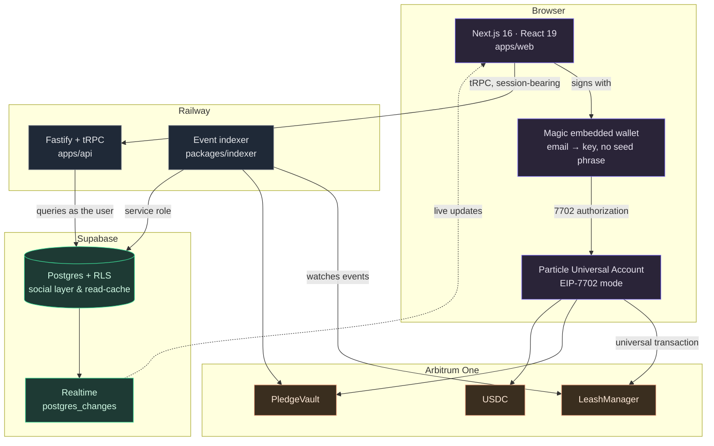

# FLOAT

**Your money. Any chain. Just send.**

A chain-abstracted social money layer. One product, four modes, one identity, one balance — and the user never sees a chain selector, a gas prompt, or a bridge step.

---

## The problem

Crypto users don't have one money problem. They have four, and they share a root: **your assets are scattered across chains, and every action involving another person forces you to think about infrastructure instead of intent.**

You have USDC on Base from one thing and ETH on Arbitrum from another. Paying a friend means picking a chain they also use. Splitting a dinner four ways means everyone bridges first. Giving someone a spending budget means either handing over custody or building a multisig. Committing money to a goal means trusting a custodial service with your card.

## The solution

FLOAT replaces the infrastructure layer with intent: **send, split, delegate, commit.**

| Mode | What it does |
|---|---|
| **Send** | Pay anyone by ENS name, Farcaster handle, or email. No chain selection, no address copy-paste. |
| **Split** | A group tab where each member settles from whatever they happen to hold. |
| **Leash** | A scoped spending key into your balance — capped, time-limited, revocable. You keep custody. |
| **Pledge** | Lock funds against a goal with a witness. Miss it and the stake fires to a destination you nominated. |

Recipients don't need an account. A claim link provisions their wallet at the moment they open it — no install, no seed phrase.

---

## Live on Arbitrum One

Both contracts are deployed and source-verified on mainnet:

| Contract | Address |
|---|---|
| **LeashManager** | [`0x63139db9…5b4091`](https://arbiscan.io/address/0x63139db97859661CfDe4e6a0Af55Ab368a5b4091#code) |
| **PledgeVault** | [`0x925853a3…60Fc9d`](https://arbiscan.io/address/0x925853a320914126DcFa0a3875D2722EeC60Fc9d#code) |

**The EIP-7702 upgrade is verifiable on-chain.** The owner EOA's code reads `0xef0100` + the delegate address — the canonical EIP-7702 delegation designator — and the settlement transaction is [type `0x4`](https://arbiscan.io/tx/0xba733747cd8b4239aaf505e6993115e6382575473ac32f3bfa8e4b36068ba638), the SetCode transaction type. The address never changed. Gas was paid by a relayer, not the user.

---

## Architecture



**Who owns what.** The chain is authoritative for money and authority. Postgres is authoritative for the social layer — handles, links, notes, notifications — and is a read-cache the indexer keeps in lockstep.

That split is enforced, not aspirational. `leash.spent` is never written by the API; it is derived from the contract's own `remaining` field when the indexer sees a `LeashSpent` event. Settle and witness verdicts require a transaction hash, so the database can't claim a settlement the chain never saw. On-chain calls happen *before* the row is written, so a failed transaction leaves no record behind.

---

## Quickstart

Under five minutes from a clean clone.

```bash
git clone https://github.com/winsznx/float.git && cd float
npm install
cp .env.example .env.local     # fill in the keys below
npm run dev                    # web on :3000
```

The API and indexer run alongside:

```bash
npm run dev --workspace @float/api        # :4000
npm run start --workspace @float/indexer  # watches Arbitrum One
```

### Keys you'll need

| Service | Keys | Where |
|---|---|---|
| Supabase | url, anon, service-role | [supabase.com](https://supabase.com) → project settings → API |
| Particle | project id, client key, app uuid | [dashboard.particle.network](https://dashboard.particle.network) — create a **Web** app |
| Magic | publishable + secret | [dashboard.magic.link](https://dashboard.magic.link) |
| Neynar | api key | [neynar.com](https://neynar.com) — Farcaster resolution |
| Resend | api key | [resend.com](https://resend.com) — claim and witness emails |
| RPC | Arbitrum + Ethereum | any provider; Alchemy works |

`SUPABASE_JWT_SECRET` is **not** required — sessions are minted by Supabase itself, so the project's signing-key regime doesn't matter.

### Database

```bash
npm run db:push --workspace @float/db      # 4 migrations
npm run types:gen --workspace @float/db    # regenerate types
```

---

## Verifying it works

Every layer has a suite that runs against real infrastructure — no fixtures, no mocks.

```bash
npm test --workspace @float/contracts              # 52 contract tests
npm run verify:rls --workspace @float/db           # 29 RLS boundaries, real JWTs
npm run verify:session --workspace @float/db       #  9 session minting
npm run verify --workspace @float/api              # 35 endpoints, live ENS/Neynar/Particle
npm run verify:security --workspace @float/api     # 23 attack boundaries
npm run verify --workspace @float/indexer          # 12 real mainnet events, costs ~$0.15
```

The indexer suite genuinely spends money: it creates a leash on Arbitrum One, spends against it, revokes it, and asserts Postgres mirrors each event.

---

## Stack

| Layer | Choice |
|---|---|
| Frontend | Next.js 16.2 · React 19 · TypeScript · Tailwind v4 |
| Accounts | Particle Universal Accounts (EIP-7702) · Magic embedded wallets |
| API | Fastify · tRPC (authenticated) + REST (capability links) |
| Database | Supabase Postgres, RLS on every table |
| Indexer | viem, polling with a persisted cursor |
| Contracts | Solidity 0.8.24 · OpenZeppelin · Hardhat |
| Settlement | Arbitrum One |

**Why tRPC *and* REST.** The app is typed end to end — `AppRouter` is imported directly by the web client, so a server shape change is a compile error rather than a runtime surprise. But claim, settle, and witness links are opened by people with no session, from a URL someone messaged them. Those are plain REST with capability tokens, which is far easier to reason about than anonymous tRPC context.

---

## Security

| Layer | Mechanism | Enforcement |
|---|---|---|
| Session | Magic DID verified server-side, Supabase mints the session | Client never asserts its own identity; the DID is validated against Magic's API before any session exists |
| Authorization | Row-Level Security on all 11 tables | Authenticated queries run through a client bearing the user's token — Postgres refuses, not application code |
| Indexer writes | Service role, deny-by-default tables | `activity`, `leash_spends`, `indexer_state` have no user policy, so only the service role can write them |
| Capability links | Unguessable per-row tokens, scoped queries | A settle token can only settle *its own* split's members; a private pledge 404s on the public route |
| Money authority | Chain is authoritative | `leash.spent` derived from contract state; settle and verdict require a tx hash |
| Contract authority | `msg.sender` checks, custom errors | `spend` is beneficiary-only, `revoke` owner-only, resolution witness-only, all reverting explicitly |
| Slash timing | 72-hour witness grace period | `claimExpired` is permissionless only after `deadline + 72h`, so the witness can't be front-run at deadline+1s |
| Replay / reorg | `(tx_hash, log_index)` unique keys, derived counters | Re-applying a log is a no-op; a resolved pledge never leaves its terminal state |
| Transport | Rate limits, security headers | 120/min app, 30/min capability links; nosniff, DENY framing, no-referrer |
| Input | Zod on every procedure | Negative amounts, malformed addresses, the zero address, oversized notes and path-traversal handles all rejected |
| Secrets | Env only, `.env.example` blank | No secret has ever been committed; verified across full git history |

**Not guaranteed on-chain:** `LeashManager` scopes by beneficiary, token, cap, and expiry. Per-contract allowlisting is stored for the UI but is *not* enforced by the contract — don't read it as a chain-level guarantee.

---

## Honest limitations

- **Contracts are unaudited.** 52 tests including every failure path, but no third-party audit. Don't put real money at risk.
- **The pledge slash is same-chain.** `PledgeVault` transfers the escrowed ERC20 to the destination on Arbitrum. The cross-chain property is on the *funding* side — the UA sources your stake from wherever you hold value.
- **The UA SDK is mainnet-only.** `createUniversalTransaction` rejects every testnet, which is why the contracts had to go to Arbitrum One rather than staying on Sepolia.
- **Gitcoin and DAO failure destinations are unconfigured.** Only the burn address ships with a real address; the others are marked unavailable rather than shipped with a plausible-looking guess.

---

## Repo layout

```
apps/web            Next.js frontend
apps/api            Fastify + tRPC API
packages/contracts  Solidity, Hardhat, deployments
packages/indexer    Event worker
packages/db         Migrations, RLS, generated types
```

Everything runs from the root: `npm run dev`, `npm run build`, `npm run lint`, `npm run typecheck`.
