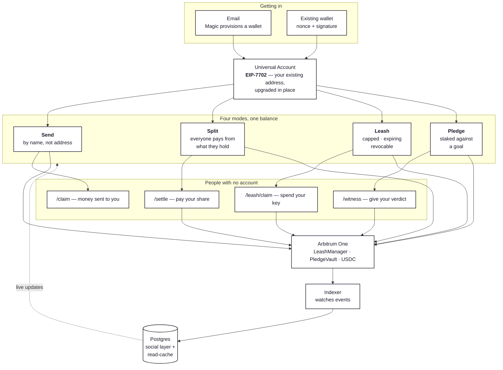

# FLOAT

**Your money. Any chain. Just send.**

FLOAT is a chain-abstracted social money layer. One product, four modes, one identity, one balance — and the person using it never sees a chain selector, a gas prompt, or a bridge step.

**Demo:** [3-minute walkthrough](https://youtu.be/ccjGMGdV5Kc) · **Live:** [float-web-production.up.railway.app](https://float-web-production.up.railway.app) · **API:** [health](https://float-api-production-c8bb.up.railway.app/health)

---

## The problem

People who hold crypto don't have one money problem. They have four, and they share a root: **your assets are scattered across chains, and every action involving another person forces you to think about infrastructure instead of intent.**

You have USDC on Base from one thing and ETH on Arbitrum from another. Paying a friend means picking a chain you both use. Splitting a dinner four ways means everyone bridges first. Giving someone a budget means handing over custody or building a multisig. Committing money to a goal means trusting a custodial service with your card.

Every one of those is a person-to-person problem, and crypto answers all of them with "first, understand our infrastructure."

## What FLOAT does

It replaces the infrastructure layer with intent: **send, split, delegate, commit.**

| Mode | What it does | Why it's hard elsewhere |
|---|---|---|
| **Send** | Pay anyone by ENS name, Farcaster handle, or email | ENS resolves to Ethereum; sending USDC to someone on Base means bridging first |
| **Split** | A group tab where each member settles from whatever they hold | Everyone has to be on the same chain, or everyone bridges |
| **Leash** | A scoped spending key into your balance — capped, time-limited, revocable | The options are lose custody, build a multisig, or use a custodial fiat card |
| **Pledge** | Lock funds against a goal with a witness; miss it and the stake fires to a destination you nominated | Commitment apps are all fiat and custodial |

Recipients don't need an account. A claim link provisions their wallet the moment they open it — no install, no seed phrase, no app.

---

## How it works



**The upgrade is real and verifiable.** In EIP-7702 mode the account you already have *becomes* the smart account — same address, no migration. On Arbitrum One, the owner EOA's code reads `0xef0100` followed by the delegate address, which is the canonical EIP-7702 delegation designator, and the [settlement transaction](https://arbiscan.io/tx/0xba733747cd8b4239aaf505e6993115e6382575473ac32f3bfa8e4b36068ba638) is **type `0x4`** — the SetCode transaction type. It was submitted by a relayer, so the user paid no gas.

**Who owns what.** The chain is authoritative for money and authority. Postgres is authoritative for the social layer — handles, links, notes, notifications — and acts as a read-cache the indexer keeps in lockstep.

That split is enforced, not aspirational: `leash.spent` is never written by the API but derived from the contract's own `remaining` when a `LeashSpent` event lands; settle and witness verdicts require a transaction hash; and on-chain calls happen *before* the row is written, so a failed transaction leaves no record behind.

---

## Live on Arbitrum One

| Contract | Address | |
|---|---|---|
| **LeashManager** | `0x63139db97859661CfDe4e6a0Af55Ab368a5b4091` | [verified ↗](https://arbiscan.io/address/0x63139db97859661CfDe4e6a0Af55Ab368a5b4091#code) |
| **PledgeVault** | `0x925853a320914126DcFa0a3875D2722EeC60Fc9d` | [verified ↗](https://arbiscan.io/address/0x925853a320914126DcFa0a3875D2722EeC60Fc9d#code) |

`LeashManager` is **pull-based, not escrow** — funds stay with the owner and move directly to the recipient at spend time, so granting a leash never means giving up custody. `PledgeVault` does escrow, because a stake nobody can touch is the entire point of a commitment device.

---

## Running it

```bash
git clone https://github.com/winsznx/float.git && cd float
npm install
cp .env.example .env.local     # fill in the keys below
npm run dev                    # web on :3000
```

The API and indexer run alongside:

```bash
npm run dev   --workspace @float/api        # :4000
npm run start --workspace @float/indexer    # watches Arbitrum One
```

### Keys

| Service | What for | Where |
|---|---|---|
| Supabase | database, auth, realtime, storage | [supabase.com](https://supabase.com) → Settings → API |
| Particle | Universal Accounts (create a **Web** app) | [dashboard.particle.network](https://dashboard.particle.network) |
| Magic | email wallets | [dashboard.magic.link](https://dashboard.magic.link) |
| Neynar | Farcaster handle resolution | [neynar.com](https://neynar.com) |
| Resend | claim and witness emails | [resend.com](https://resend.com) |
| RPC | Arbitrum + Ethereum | any provider |

`SUPABASE_JWT_SECRET` is **not** needed — sessions are minted by Supabase itself, so the project's signing-key regime doesn't matter.

Add your deployed URL to Magic's **Allowed Origins** (exact origin, no trailing slash) or login will be refused.

### Database

```bash
npm run db:push   --workspace @float/db    # 5 migrations
npm run types:gen --workspace @float/db    # regenerate types
```

---

## Verifying it

Every layer has a suite that runs against real infrastructure. No fixtures, no mocks.

```bash
npm test                --workspace @float/contracts   # 52 contract tests
npm run verify:rls      --workspace @float/db          # 30 RLS boundaries, real JWTs
npm run verify:session  --workspace @float/db          #  9 session minting
npm run verify          --workspace @float/api         # 35 endpoints, live ENS/Neynar/Particle
npm run verify:security --workspace @float/api         # 23 attack boundaries
npm run verify          --workspace @float/indexer     # 12 real mainnet events (~$0.15)
npm run e2e             --workspace @float/web         # 11 browser tests over the lifecycle
```

Two of these spend real money on purpose. The indexer suite creates a leash on Arbitrum One, spends against it, revokes it, and asserts Postgres mirrors each event. `npm run e2e:prod` runs the browser suite against the deployed URL.

The E2E suite exists because **every bug that reached a real user lived between layers** — the API suite passed, the security suite passed, and the app was still broken because nothing drove a browser. Each test names the regression it prevents.

---

## Architecture

```
apps/web            Next.js 16 · React 19 · Tailwind v4
apps/api            Fastify · tRPC (app) + REST (capability links)
packages/contracts  Solidity 0.8.24 · Hardhat · OpenZeppelin
packages/indexer    viem event worker, persisted cursor
packages/db         migrations, RLS, generated types
```

Everything runs from the root: `npm run dev`, `npm run build`, `npm run lint`, `npm run typecheck`.

**Why tRPC *and* REST.** The app is typed end to end — the web client imports `AppRouter` directly from the API package, so a server shape change is a compile error rather than a runtime surprise. But claim, settle, witness, and leash links are opened by people with **no session**, from a URL someone messaged them. Those are plain REST with capability tokens, which is far easier to reason about than anonymous tRPC context.

**Why the indexer polls rather than subscribes.** Polling survives RPC restarts without reconnection logic, and a persisted cursor makes it lossless: a worker that was down for a day backfills the gap on boot instead of silently missing it.

---

## Security

| Layer | Mechanism | How it's enforced |
|---|---|---|
| Session | Magic DID verified server-side; Supabase mints the session | The client never asserts its own identity — the DID is validated against Magic before a session exists |
| Wallet sign-in | Server-issued single-use nonce, signature verified server-side | An address alone proves nothing; nonces are consumed on read so a captured signature can't be replayed |
| Authorization | Row-Level Security on every table | Authenticated queries run through a client bearing the user's token — **Postgres refuses, not application code** |
| Indexer writes | Service role against deny-by-default tables | `activity`, `leash_spends` and `indexer_state` have no user policy at all |
| Capability links | Unguessable per-row tokens, scoped queries | A settle token can only settle *its own* split's members; a private pledge 404s on the public route |
| Money authority | The chain is authoritative | `leash.spent` is derived from contract state; settle and verdict require a tx hash |
| Contract authority | `msg.sender` checks with named errors | `spend` is beneficiary-only, `revoke` owner-only, resolution witness-only |
| Slash timing | 72-hour witness grace period | `claimExpired` is permissionless only after `deadline + 72h`, so a witness can't be front-run at deadline+1s |
| Replay / reorg | `(tx_hash, log_index)` unique keys, derived counters | Re-applying a log is a no-op; a resolved pledge never leaves its terminal state |
| Transport | Rate limits, security headers, `trustProxy` | 120/min app, 30/min capability links; nosniff, DENY framing, no-referrer |
| Input | Zod on every procedure | Negative amounts, malformed and zero addresses, oversized notes and path-traversal handles all rejected |
| Secrets | Env only; `.env.example` is blank | No secret has ever been committed — verified across the full git history |

**Not guaranteed on-chain:** `LeashManager` scopes by beneficiary, token, cap, and expiry. Per-contract allowlisting is stored for the UI and is **not** enforced by the contract. Don't read it as a chain-level guarantee.

### Reporting a vulnerability

Open a [security advisory](https://github.com/winsznx/float/security/advisories/new) rather than a public issue. Please include the affected layer, a reproduction, and the impact you believe it has.

---

## Honest limitations

Stated plainly, because a demo that oversells is worse than one that doesn't.

- **The contracts are unaudited.** 52 tests including every failure path, but no third-party audit. Don't put real money at risk.
- **The pledge slash is same-chain.** `PledgeVault` transfers the escrowed ERC-20 to the destination on Arbitrum. The cross-chain property is on the *funding* side — the Universal Account sources your stake from wherever you hold value.
- **The Universal Account SDK is mainnet-only.** `createUniversalTransaction` rejects every testnet, which is why the contracts had to ship to Arbitrum One rather than stay on Sepolia.
- **Gitcoin and DAO failure destinations are unconfigured.** Only the burn address ships with a real one; the others are marked unavailable rather than shipped with a plausible-looking guess.
- **Magic's OTP modal is untested by automation.** The code goes to a real inbox, so E2E seeds a real session instead. That one step is covered by hand.

---

## Contributing

```bash
npm install
npm run lint && npm run typecheck && npm run build
```

All three must pass before a PR — CI runs the same three on every push, with `--max-warnings=0`.

**Ground rules**, which exist because breaking them caused real bugs in this codebase:

1. **No mocks, no fake data.** Every rendered value comes from Postgres or the chain. A hardcoded `MAX_AMOUNT` once offered users money that didn't exist.
2. **Verify SDK calls against installed types** (`node_modules/<pkg>/**/*.d.ts`) before writing them. A guessed method signature is the most expensive failure mode here.
3. **The chain lands first.** Fire the transaction, *then* write the row — never the reverse, or the database will claim authority the chain never granted.
4. **Every state-changing contract function emits a named event** with indexed fields.
5. **Add a test that names the regression.** If you fix something a user hit, the test's title should say what it prevents.
6. **Never suppress a type error.** No `as any`, no `@ts-ignore`.

Branch per change, run the relevant verify suite, and open a PR against `main`.

---

## License

MIT — see [LICENSE](./LICENSE).

---

<sub>Built on Particle Network Universal Accounts, Magic Labs, and Arbitrum.</sub>
